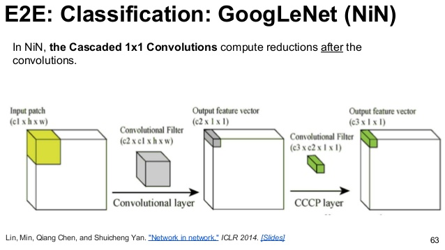
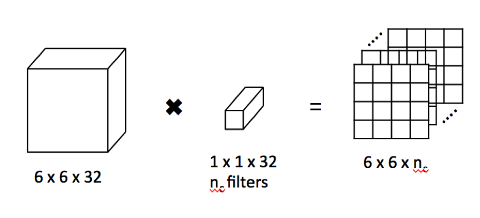
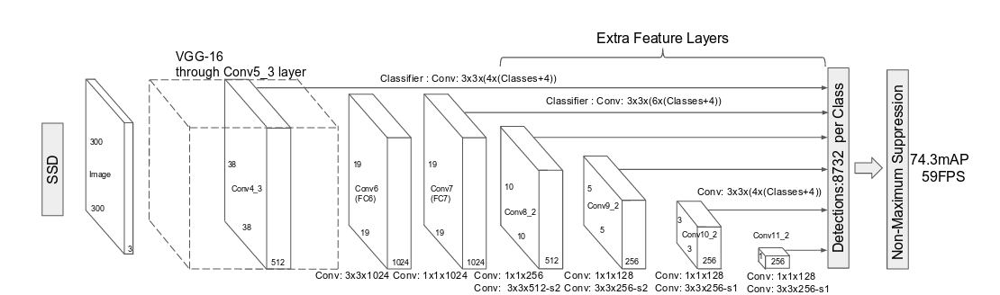

# 1x1 Convolutions 

1x1 convolutions, despite being deceptively simple, have seen widespread use in modern CNN architectures. The output of a convolutional layer, after convolving the input feature map with p filters, has a depth of p. We can use n convolutional filters with 1x1 size and depth p in order to output a feature map with the same size, but with a different depth. 1x1 filters do not change the receptive field of the output feature map, however, they allow us to compress feature maps and can help us learn low-level representations of the feature maps.

*Feature map compression*

1x1 convolutions also help significantly reduce the computational cost of any further 3x3 and 5x5 convolutions by reducing the depth of the filters required, thereby reducing the number of multiplications and additions performed.

*SSD-utilizes 1x1 convs before and after expensive 3x3 and 5x5 convs*

Another interesting application of 1x1 Convolutions is the replacement of fully connected layers entirely in CNNs. A feature map can be convolved with a filter of the same size with no padding, outputting a scalar value for each filter.
Then, 1x1 filters are used as a replacement for the fully connected layer and output a linear combination of the input activation. This can aid us in training with multiple input image sizes, as size constraint is removed by the 1x1 convolution.