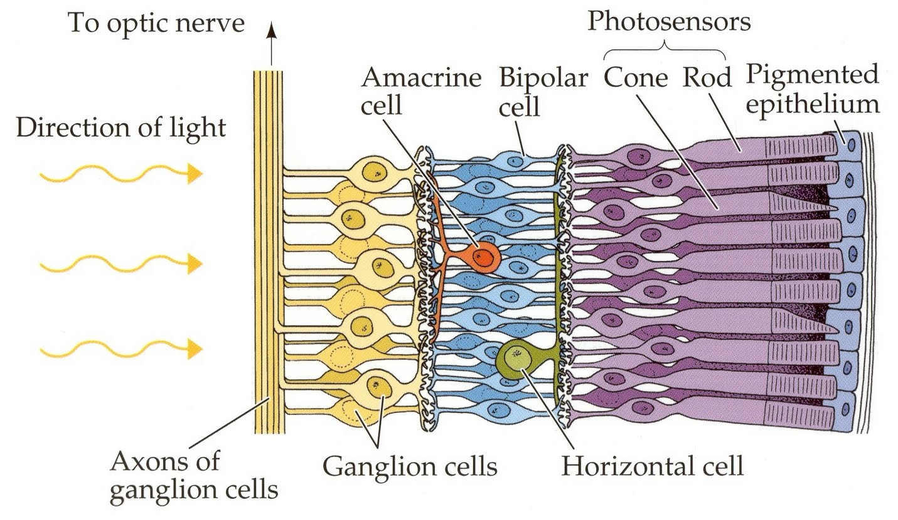

# Convolution

## What is Convolution?
Convolution is a binary operator that takes in 2 tensors and outputs a 3rd tensor. The easiest way to explain it is *Flip and drag*. The second operand (the filter) is dragged over the first operand as shown in the below gif.
( Note : In other fields, convolution involves both a vertical and horizontal flip  of the filter before performing the sliding sum. This is done to preserve associativity of convolution. Associativity is not very important in CNNs, hence we omit the flipping.) 

*Mathematical formulation of 2D convolution*

*An animation of 2D convolution*

*2D convolution with numbers*

## Why convolution?
CNNs are the state of the art in image classification -why do they work so well?
CNNs are inspired by the structure of our eye.
The time complexity of Convolution can be easily seen to be (width

*CNNs-Inspired by heirarchical structure of the eye-local connectivity can be seen in the image*

Unlike fully connected layers, convolutions have *local connectivity*, ie. activations are affected by only a part of the input feature map. *Weight sharing* is another special feature of convolutional layers. Weight sharing implies that the weights of the filter are shared for all strides of the convolutional filter. Convolutional filters act like feature detectors, thereby we see that a feature detector is useful in ALL parts of the image, hence we use weight sharing.

*Application of a filter to an image- acts like an edgte detector*

## Convolution with Depth
The output of a convolutional layer is called a feature map. We stack the feature maps of multiple filters to a depth d.

Filters of the same depth d are applied to this feature map. Thereby we are technically convolving with a filter of size (width\*height\*depth). 

*2D Convolution with depth of 3 and 4 filters*